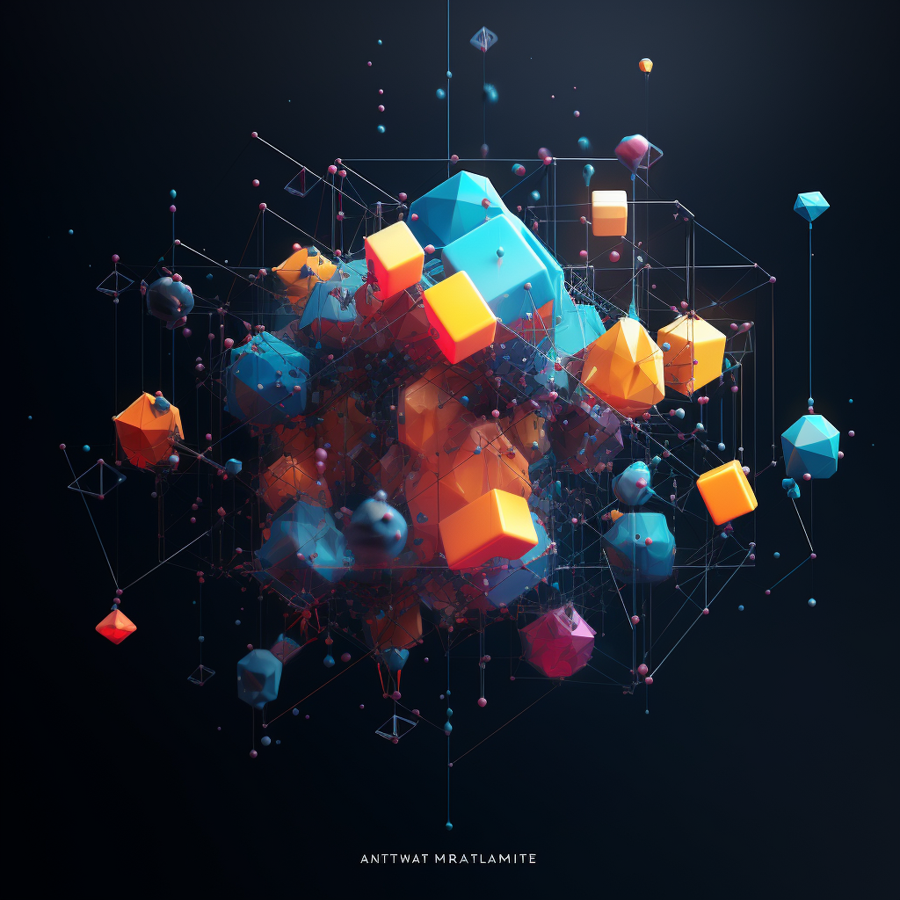

  <!-- This is the image header -->

Abstract matter is a coalition of thoughts and experience that takes a very different perspective on the world around us. The topics of discussion include Data Science, Machine Learning, Artificial Intelligence and how these integrate into industry and philosophy.

## The author

My name is Nilay Doshi with over 8+ years of experience with multiple industries dealing with Consumer Insights. As a generalist i thrive in solving complex business problems through research and algorithmic models. My passions lie in constantly exploring and coalescing concepts from different domains and bringing them to life either theoretically or practically through modeling and simulations.