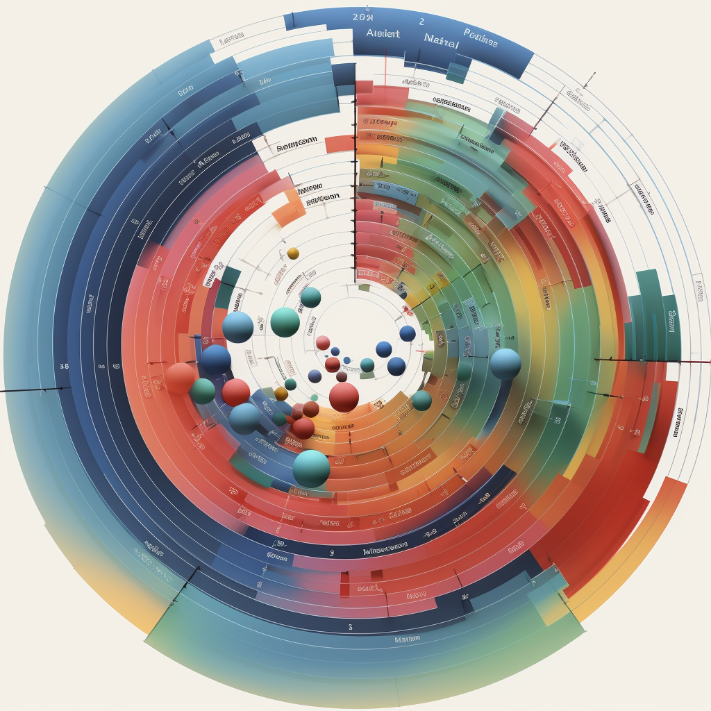
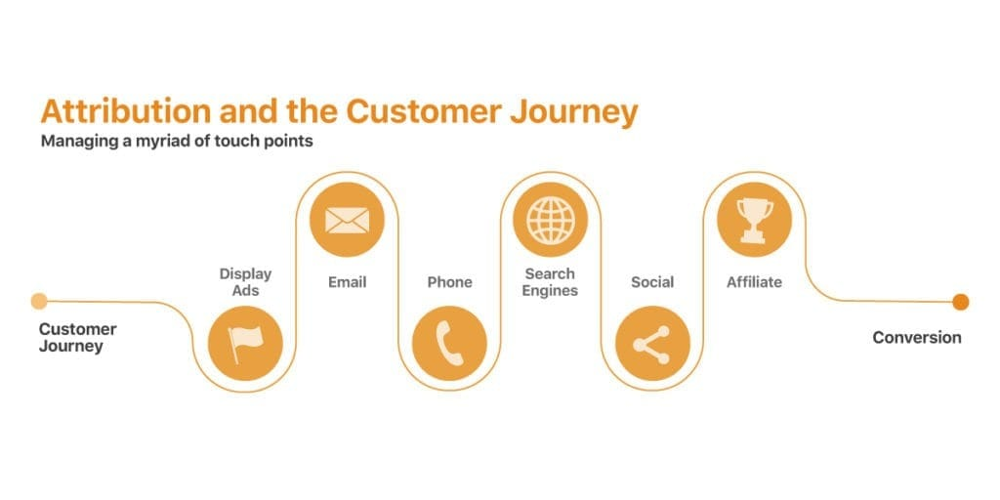
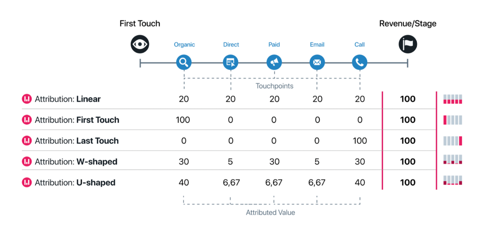

  <!-- This is the image header -->

MTA models are quite flexible in the sense that you could design the consumer journey as per your business dynamics. In the previous post we did mention the streamlined consumer decision model but there is no saying that model would be applicable to a B2B software company. Its possible for your usecase you might not need to deep dive into the loyalty loop at all but just actuate the classic journey. Simply put, a consumer interacts with multiple touchpoints before converting. These journeys can be ever so complex and the question arises how to duly attribute the credit to attribution and optimize investments on media. This is where __attribution models__ come in.
<!-- more -->
 
 
{:.centered}

  Image Source: <a href="www.adparlor.com">Link</a>

## The Cross-Channel Dilemma

Whenever we think of creating an attribution model encompassing all the touchpoints that led to the consumers conversion - its usually focused on digital channels. Its quite common to see it in this way and to be honest its pretty robust. Google analytics' behavior flow is one such example which displays beautifully the path taken by consumers on digital channels. But, how about the journey being a mix of offline channels or a mix of online and offline both. The challenge lies in the complexity and difficulty of tracking and attributing offline conversions [[1]].

The primary reason for the focus on digital channels in attribution models is the ease of tracking and data collection. Digital channels like email, display ads, social media, and search ads provide readily available data on user interactions, making it easier to credit each touchpoint in the customer journey. Some challenges with of attributing to brick and mortar touchpoints are:

- Determining which channel or campaign led to the offline conversion. Lets say you were walking down the street and you see a billboard, a lamp post ad and a in mall hoarding. Whats to say that the purchase you made thereafter is attributed to either one of them. In contrast, digital channels are quite easy to measure since every click, navigation, time spent on a page etc is measured which makes attribution more justifiable.
- Moreover, integrating online and offline marketing channels can be complicated due to data silos, fragmentation, and different tools, platforms, and metrics used to collect and analyze data within the organization can make it difficult to consolidate and measure the influence of each touchpoint [[2]].

Despite these challenges, its not impossible to create attribution models integrating online and offline channels. Implementing a cross-channel attribution model can enhance the understanding of each channel's role in the customer journey, leading to informed decisions.

## To Learn Heuristically, or not is the Question

Now that we a basic understanding of what MTAs do we can actually dive into the models. Broadly, MTA models can be either heuristic or algorithmic. It comes down to how complex the business problem is that we are trying to solve and availability of data that decides what we go with.

Heuristics are simple rule based models that focus on approximate rather than precision. Its usually trade off favoring efficiency for a similar to right one answer rather getting the precise answer. Algorithmic models, on the other hand, use advanced statistics (and machine learning at times to build conversion prediction models from highly sequentially dependent scenarios) to objectively determine the impact of marketing touches along a customer’s journey toward conversion. These models are data-driven and consider a wide array of factors, including the sequence of touchpoints, the time between them, and the context of each interaction [[3]] [[4]].

Some advantages of using algorithmic models over heuristics are:

- Algorithmic attribution is considered the most robust method of attribution analysis, as it can provide a more accurate view of which channels are top converters [[5]]. Heuristic models are more straightforward and may be suitable for simpler marketing strategies or smaller organizations with limited data.
- Heuristic models can introduce unwanted bias considering they are rule based.
- Algorithmic models can improve over time as they analyze more data, making them particularly suitable for complex customer journeys that involve multiple online and offline touchpoints.

Heuristic models are plenty such as last interaction, first interaction, linear, time decay, position based, last click non-direct and the list goes on. Thats because these are rule based and whats to stop from making your own strategy based custom rules. These are heuristic models since first interaction credits the conversion to the very first touchpoint while the last interaction does the opposite. Linear gives equal importance to all the touchpoints and so on.
 
 
{:.centered}

  An example of of how credits are assigned within heuristic models of different types across touchpoints - <a href="https://docs.dreamdata.io/article/tycc6odb2v-attribution-model">Link</a>

Statistical models are of two main types: Shapely value and Markov chains. Both these models have their own strengths and weaknesses and are applicable in very specific business contextual scenarios informed by the data you are working with.

The focus of this article series is neither heuristic or statistical models but rather a specific type of deep learning model that leverage __Long Short Term Memory (LSTM) Attention models__. Statistical models do not account for sequential dependencies, meaning that they fail to consider the preceeding channels within a sequence its impact on subsequent steps. Considering we are deeply invested in the consumer decision journey this becomes even more critical to account for.