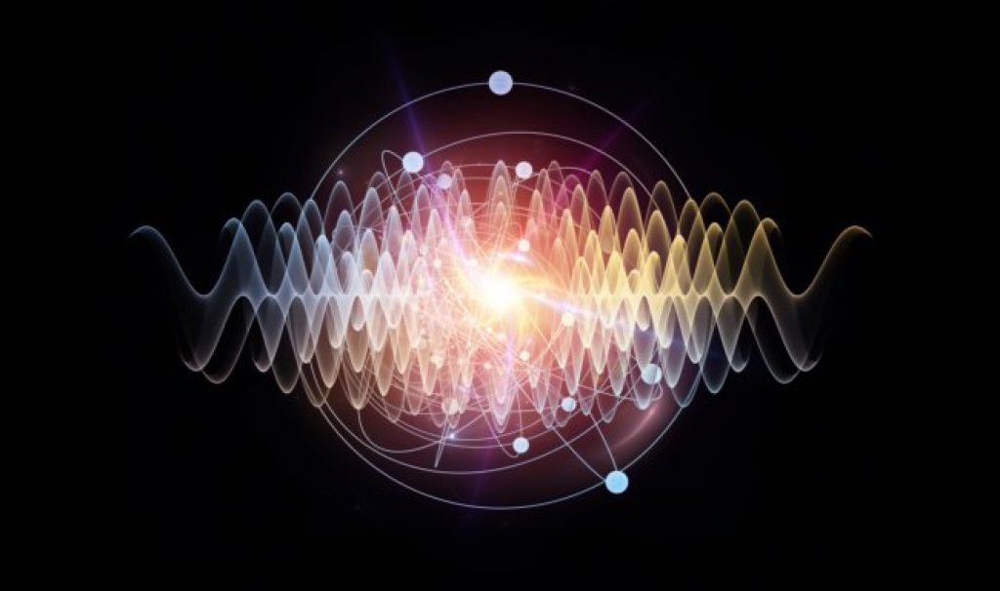
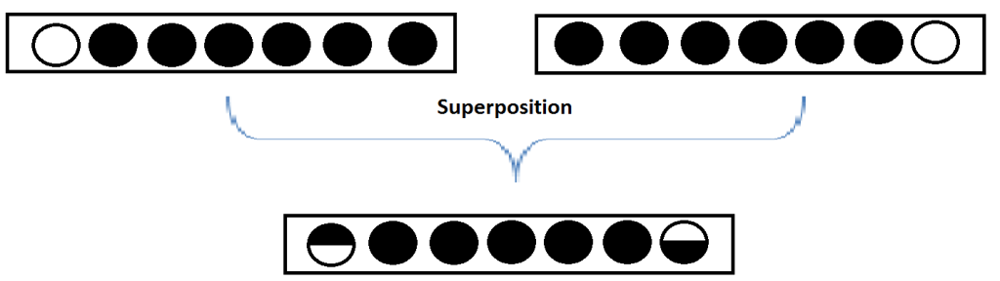
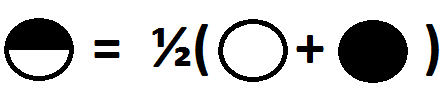

  <!-- This is the image header -->

My first encounter with the concept of matter and anti-matter came while reading the works of the author Dan Brown. The novel ‘The Da Vinci Code’ spoke about a plot where the scientists at CERN had successfully created anti matter. Typically if anti matter comes in contact with matter it would annihilate each other leaving behind pure energy. It is hence believed that particle and anti particle were buzzing into existence during the birth of the universe, the big bang. Majorana fermions on the other hand are fermions which are its own antiparticle and its bound states are governed by non-abelian statistics.
<!-- more -->
This concept maybe hard to grasp, but [Dr. Leo Kouwenhoven](https://qutech.nl/person/leo-kouwenhoven/) could not have explained it better in his FOM (Fundamental research on matter) lecture at Veldhoven in 2013. As he explained, lets consider a chain of fermions such as electrons with a hole at one end. Due to the potential difference the electron has a tendency to immediately fill up the hole to attain equilibrium. Subsequently, it pulls all the remaining electrons along with it to occupy the empty space, this creates a hole at the other end of the chain. The process continues back and forth until it comes to a point where the electron and hole are now superimposed at both ends. Thus, there is a 50% chance of either finding a hole or electron at this point on both ends. This is the majorana fermion, a particle that is its own anti matter.
 
 
{:.centered style="width:600px; height:auto;"}

{:.centered style="width:200px; height:auto;"}

  Image Source: <a href="https://nanobiologyhonoursprogrammeblog.wordpress.com/2014/12/10/majoranas/">Link</a>

The discovery and manipulation of majorana has major implications in the field of quantum computing. The possibility of not having bits 1 and 0 but also having both together at the same time increases computation speed marginally. What incites curiosity is exploring topics like electron teleportation and actuation through induced localized surface plasmon resonance. The scope of LSPR induced spin dynamics is massive.