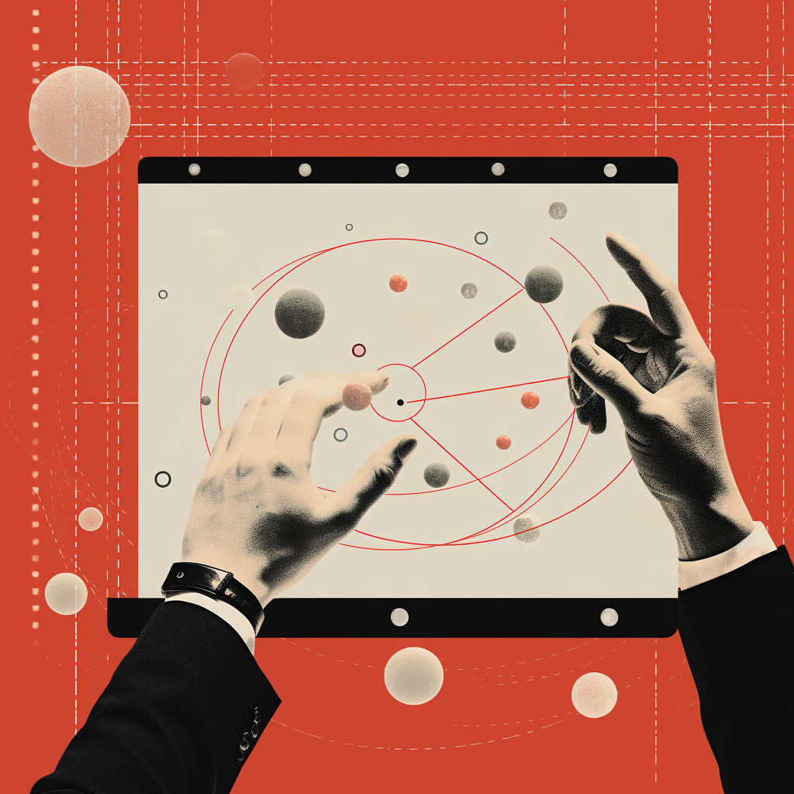
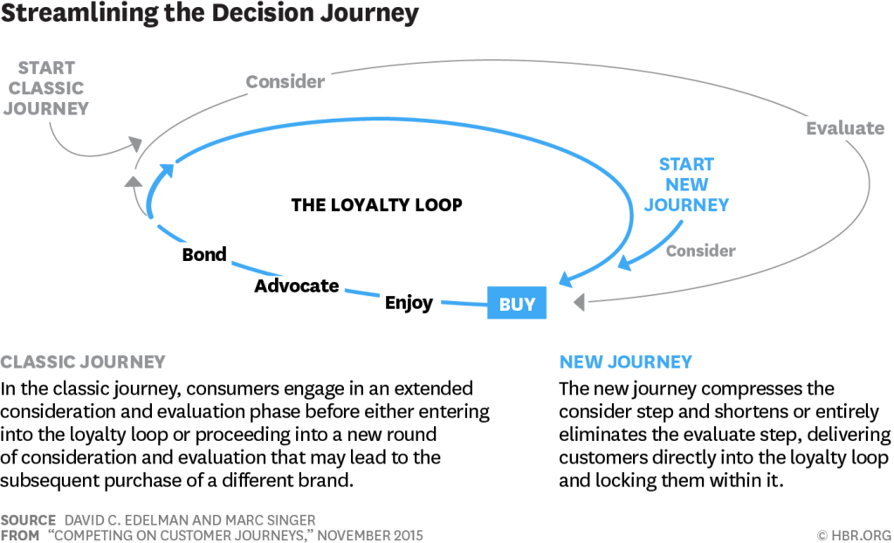

  <!-- This is the image header -->

## Introduction

Consumer decisiveness is always subjective to the experiences under a common context. The attitude of a consumer towards a purchasing behavior is always influenced by a multitude of intrinsic and extrinsic factors. Intrinsic factors are internal to the individual and can include aspects such as personal beliefs, attitudes, perceptions and personality. 
<!-- more -->
Typically these are shaped over years of social engineering from the surrounding environment and interactions. Extrinsic factors on the other hand are external influences are more short term that impact the consumer behavior such as exposure to marketing activities, product features, quality, social influences and so on. The combination of these intrinsic and extrinsic factors translates onto how a consumer interacts with different touchpoints around and moreover what steps one takes before making a final purchase. These steps and interactions cover whole decision journey as best personified by David Edelman and Marc Singer.
 
 
{:.centered}

Imagine a data scientist who is asked to evaluate the effectiveness of all the offline and online touchpoints in the customer journey and also map the optimal routes towards purchase. The general standard in this situation is to scope the entire journey as a marketing mix campaign to assess the effectiveness of every media channel. Take the paid, earned and owned media channels spends along with macroeconomic indicators to look for emerging causalities as a sum of:

1. A seasonal baseline (the sales the model believes we would have without any marketing)
2. Marketing activities (ad campaigns, pricing, promotions)
3. Product development initiatives (formulation changes, enhancements, launches)
4. Competitor effects (competitor's campaigns, pricings, promotions)
5. Macro influences (economy, exchange rates, Covid-19 lockdowns)

What this does not do is -

- Explain the attribution of specific interactions. MMM provides extremely high level insights which are a wholistic report card of sorts of the complete marketing efficacy.
-At the same time you are also very dependent on external macroeconomic factors which are consistently changing over time.
-MMM models are largely very resource intensive and most difficult task is to collect reliable and accurate data about a companies marketing and sales as well as competitors. If the model is built on low quality data then the results will be directional at best. __If our inputs are garbage, so will our conclusions — Garbage In, Garbage Out (GIGO)__.

## The Rise of Multi-Touch Attribution

So without access to individual touchpoints and the assurance of great data, what does the data scientist do? The industry answer is __Multi-Touch Attribution Modeling (MTA)__.

>Multi-touch attribution is a method used in marketing analytics to measure the impact of individual touchpoints or channels on a customer's path to conversion. It aims to allocate proper credit to each touchpoint, helping marketers understand the effectiveness of their marketing efforts and optimize their strategies accordingly

Understanding the consumer decision journey is where the MTA model really shines. Thats not to say that its a frictionless solution without limitations. Our purchase journey today has been quite an extensive process and is in no way linear. The consumer journey has many touchpoints and inputs that taps and stress tests the brand funnel. MTA helps businesses navigate the complex and non-linear path customers take from discovering a brand to making a purchase and beyond.

MMM is an older practice developed in the 1960s. While it does explain the media effectiveness and encompasses the most significant factors that influences the consumer, the result is just too broad. The marketing landscape has drastically evolved over the last few decades especially with globalization. This requires marketeers to take a more tactical and surgical approach to get an accurate picture of the consumer journey. Ultimately, this allows companies to make continual improvements to customer lifetime value experience and lifecycle, fueling brand loyalty for years to come.

## The Marketers Perspective

The fundamental objective of consumer research is to mitigate the risks associated with the behavior. Furthermore, consumers engage in research to maintain a sense of autonomy and control over purchasing behaviors. The emphasis being on 'maintaining' a sense of autonomy while not fully exercising any such form of control over behaviors. It is argued that this power dynamic between consumers and suppliers is shifting with the growth of contemporary web-based economy. Organizations today must regain control of this power shift by managing the technological empowerment of consumers. __The valuation of customer loyalty rises significantly from this perspective since consumers can switch to a competition brand in search of a better value proposition__.

In conclusion, marketing strategies have always sought to identify those consumption moments or touchpoints of influence. Traditional marketing funnels play hand in hand with the aggressive push-style communication along those touchpoints. By identifying the optimal consumer journeys to maximize purchase conversion we can segment and profile the consumers based on their decision journeys.